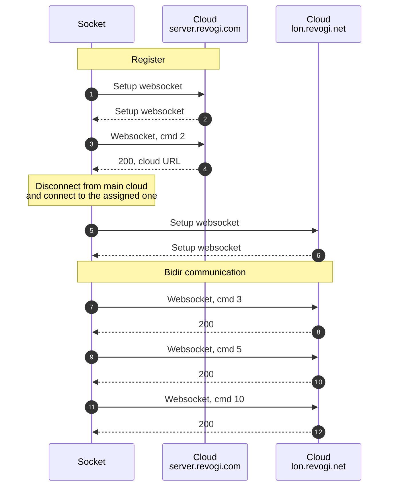

# First connect

## Overview

After wifi/eth connections setup and registration cfg, socket will connect to the cloud server.

## Command 2

Req

`V3{"sn":"SWW0123456789012","cmd":2,"regid":"rvg012345678","sak":"333444555666"}`

Resp

`V3{"code":200,"port":5000,"response":2,"regid":"rvg012345678","sn":"SWW0123456789012","cmd":2,"sak":"333444555666","url":"lon.revogi.net"}`

## Command 3, check fw version?

Req
`V3{"sn":"SWW0123456789012","cmd":3,"sak":"333444555666","ver":"3.49","ip":"192.168.2.200","mac":"00:11:22:33:44:55"}`

Resp `V3{"code":200,"newver":"3.49","url":"","checksum":0,"time":1729362616,"response":3,"cmd":3,"sn":"SWW0123456789012"}`

## Command 5 rules?

`V3{"sn":"SWW0123456789012","cmd":5,"page":0,"rule":[]}`

`V3{"code":200,"response":5,"page":0,"cmd":5,"sn":"SWW0123456789012"}`

## Command 10, report status?

`V3{"sn":"SWW0123456789012","cmd":10,"ip":"192.168.2.200","isTime":1,"time":1729366216,"zone":1,"switch":[1,1,1,1,1,1],"watt":[0,0,0,0,0,0],"amp":[0,0,0,0,0,0]}`

