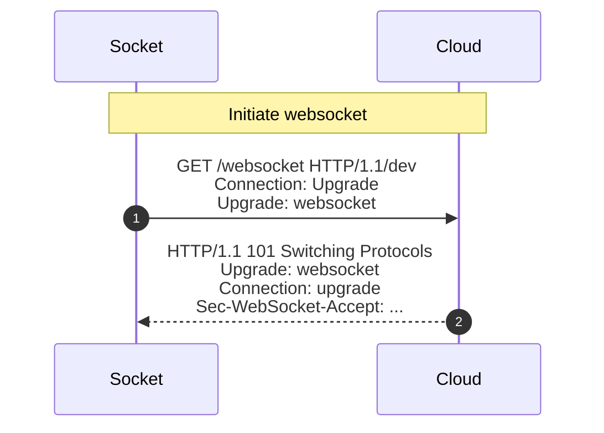

# Websocket communication

See also [RFC 6455](https://datatracker.ietf.org/doc/html/rfc6455).



## Socket to cloud request

```http
GET /websocket/dev HTTP/1.1
Host: server.revogi.com:8080
Connection: Upgrade
Upgrade: websocket
Sec-WebSocket-Version: 13
Sec-WebSocket-Key: revogi
```

Note that the `Sec-WebSocket-Key` should be base64 encoded 16B nnumber so this seems illegal.

## Cloud response to socket

```http
HTTP/1.1 101 Switching Protocols
Server: Apache-Coyote/1.1
Set-Cookie: JSESSIONID=43BCA3CC543A263D2187209AACF758BB; Path=/; HttpOnly
Upgrade: websocket
Connection: upgrade
Sec-WebSocket-Accept: +2Gdp+jdt0nq9CSUdozWguCm9aE=
Date: Fri, 18 Oct 2024 18:05:05 GMT
```

`Sec-WebSocket-Accept` should be `Base64 enc (Sha1 hash (<Sec-WebSocket-Key> + "258EAFA5-E914-47DA-95CA-C5AB0DC85B11"))`

I.e. fixed value `Sha 1 hash ("revogi258EAFA5-E914-47DA-95CA-C5AB0DC85B11")` = `fb619da7e8ddb749eaf42494768cd682e0a6f5a1` and base64 encoding gives us `+2Gdp+jdt0nq9CSUdozWguCm9aE=`.
Since the socket always sends "revogi" this is a constant.