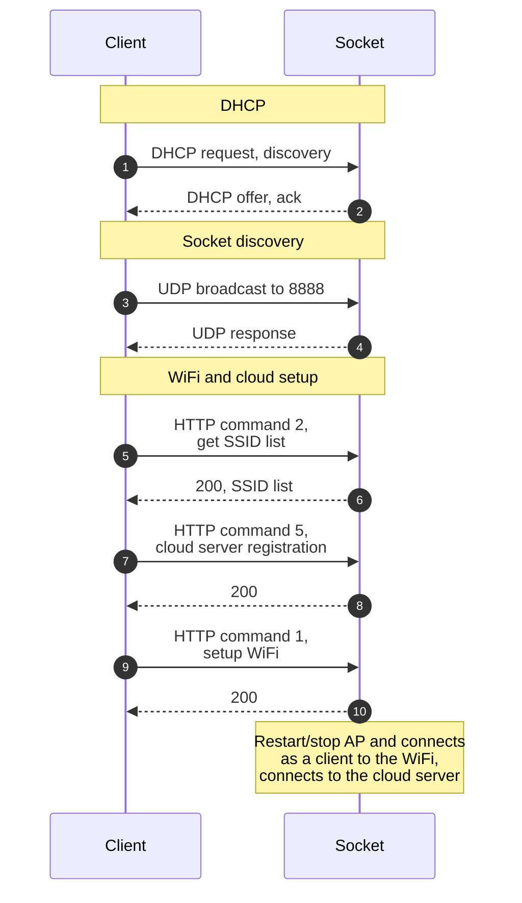

# Initialization

Socket is acting as a WiFi AP (access point, no security), client (phone app) connects to this AP.



## DHCP

Socket acting as a WiFi AP (access point, no security), running DHCP server. Client connects to it, gets assigned IP address.

## Discovery

UDP boradcast to 8888: `00dv=all,2024-10-18,14:35:37,13;`

UDP JSON response - example (using pretty format for better readibility)

```JSON
{
  "response": 0,
  "data": {
    "sn": "SWW0123456789012",
    "name": "COCOSO-ECE1",
    "regid": "rvg012345678",
    "ver": "1.06",
    "mac": "00:11:22:33:44:55",
    "sak": "333444555666",
    "active": 1,
    "resettime": 1
  }
}
```

## HTTP setup

### Command 002

Req

```json
{}
```

Response 200

```JSON
{
  "response": 2,
  "code": 200,
  "data": {
    "signal": [
      { "ssid": "ssid_01", "range": 54, "security": 5 },
      { "ssid": "ssid_02", "range": 54, "security": 5 },
      { "ssid": "ssid_03", "range": 40, "security": 5 },
      { "ssid": "ssid_02", "range": 26, "security": 5 },
      { "ssid": "ssid_04", "range": 26, "security": 7 },
      { "ssid": "ssid_05", "range": 18, "security": 5 }
    ]
  }
}
```

### Command 005

Req 
```json
{
  "regid": "rvg012345678",
  "zone": 13,
  "url": "server.revogi.com",
  "port": 5000,
  "time": 1729460140
}
```

### Command 001

Req

```json
{
  "mode": 1,
  "ssid": "ssid_02",
  "password": "secret_wifi_password",
  "security": 5
}
```

resp 200 `{"response":1,"code":200}`


Connects to the local WiFi and cloud server??